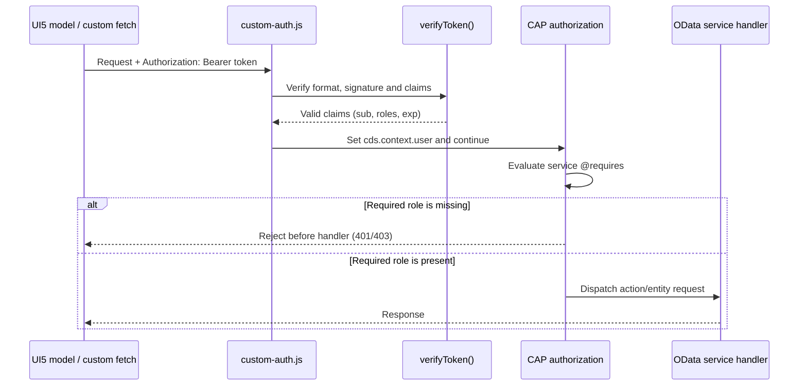

# CDX JWT Authentication Flow

## Overview

CDX issues and validates its own short-lived HS256 JWTs for local account authentication. CAP is configured to load the custom middleware in `srv/authentication/custom-auth.js` through `cds.requires.auth.impl` in [`package.json`](../package.json).

This is CAP's custom-authentication integration: the middleware validates each bearer token and assigns a `cds.User` to `cds.context.user`. CAP then enforces CDS `@requires` annotations. It is distinct from CAP's built-in `jwt` strategy, which validates tokens from a configured trusted identity provider such as XSUAA or IAS. The local implementation does not use an identity provider.

## Repository Map

| Area | File | Responsibility |
| --- | --- | --- |
| CAP configuration | [`package.json`](../package.json) | Selects `custom-auth.js`, selects development SQLite, and defines `db:init` and `bootstrap-admin` scripts. |
| CAP service discovery | [`srv/index.cds`](../srv/index.cds) | Imports authentication, admin, dashboard, organization setup, and user-management service models. A new service must be imported here to be served. |
| Authentication contract | [`authService.cds`](../srv/authentication/authService.cds) | Declares `AuthenticationService`, its public actions, and response types. |
| Login and bootstrap handlers | [`authService.js`](../srv/authentication/authService.js) | Resolves login credentials, reads role groups, issues tokens, and enforces first-account-only bootstrap. |
| Account persistence | [`accounts.js`](../srv/authentication/accounts.js) | Validates account fields, hashes passwords, creates role groups/accounts, and maps user responses. |
| JWT and password primitives | [`security.js`](../srv/authentication/security.js) | Hashes/verifies passwords and issues/verifies HS256 tokens. |
| CAP authentication adapter | [`custom-auth.js`](../srv/authentication/custom-auth.js) | Converts a validated bearer token into `cds.context.user`. |
| Admin-only API | [`userAdministrationService.cds`](../srv/userManagement/userAdministrationService.cds) and [`userAdministrationService.js`](../srv/userManagement/userAdministrationService.js) | Requires the `admin` role and delegates account creation to `accounts.js`. |
| First-admin CLI | [`bootstrap-admin.js`](../scripts/bootstrap-admin.js) | Collects first-admin details locally and calls the one-time bootstrap action. |
| Browser login/session | [`auth.js`](../app/auth.js), [`login.js`](../app/login.js) | Calls login, stores the browser token/session state, and redirects into the selected UI5 app. |
| OData token forwarding | [`launcher.js`](../app/launcher.js) | Adds the bearer token to same-origin OData models before loading the UI5 component. |
| Dashboard account form | [`UserAccounts.controller.js`](../app/dashbaord/webapp/view/UserAccounts.controller.js) | Calls the admin-only account action with the bearer token. |
| Browser logout | [`logout.html`](../app/logout.html) | Clears browser session storage and redirects to login. |

## Local Setup

The development database is the ignored SQLite file `db.sqlite`. Initialize its schema, set a stable secret for the server process, and start CAP:

```powershell
npm run db:init
$env:JWT_SECRET = node -e "console.log(require('crypto').randomBytes(32).toString('base64'))"
npx cds watch
```

`JWT_SECRET` must contain at least 32 bytes. Keep it private and keep the same value across server restarts if existing tokens should remain valid. If the secret changes, previously issued tokens fail signature validation and users must log in again.

Create the first administrator from another terminal while CAP is running:

```powershell
npm run bootstrap-admin
```

The script prompts for username, first name, last name, email, and a password; password entry is hidden and confirmed. The script calls `POST /odata/v4/authentication/bootstrapAdmin` without a JWT. The action creates an admin only when `cdx.auth.Role` contains no accounts. It returns HTTP 409 after an account exists. Do not expose this local bootstrap flow to an untrusted network.

Open `http://localhost:4004/login.html` and sign in with the new account. Administrators can then open **User Management > Accounts** to create administrator or faculty accounts. That action requires a valid admin JWT.

### Startup And Service Registration

`npx cds watch` loads the CDS model beginning at `srv/index.cds`, connects to the configured development database, and mounts each imported service at its OData URL. The authentication service is mounted at `/odata/v4/authentication`; the admin user service is mounted at `/odata/v4/user-administration`; the organization service is mounted at `/odata/v4/organization`.

The auth implementation is not a route handler registered by `authService.js`. CAP loads `srv/authentication/custom-auth.js` as its authentication middleware from `cds.requires.auth.impl` in `package.json`. CAP invokes that middleware for incoming requests before dispatching them to a service. Each service model also needs to be reachable from the root `srv/index.cds`; a CDS file not imported into the root service model is not mounted just because the file exists.

## Account Data

Accounts are stored in `cdx.auth.Role`; the account's `roleGroup` association points to a `cdx.auth.RoleGroup`. Passwords are never stored in plaintext. [`security.js`](../srv/authentication/security.js) hashes each password using Node's `scrypt` with a random salt and stores it in this format:

```text
scrypt$<base64url-salt>$<base64url-hash>
```

The user-creation helper validates the username, email, password length, and allowed role groups (`admin` and `faculty`) before inserting the account. Passwords must be 12 to 255 characters. The role group name is placed in the JWT's `roles` claim at login.

The `Role.password` field stores the encoded scrypt value, not the original password. The database model's `fullName` is a stored calculated field; the account helper returns a display name without needing to write that calculated column. Do not expose `Role.password` through an OData projection or return it in an action response.

Accounts created before this scrypt flow are not automatically compatible: `verifyPassword()` rejects values that do not use the `scrypt$...$...` format. Migrate or reset any pre-existing plaintext/mock account passwords before relying on them.

## Token Contents And Validation

[`security.js`](../srv/authentication/security.js) creates a JWT with an HS256 header and these claims:

| Claim | Purpose |
| --- | --- |
| `iss` | Fixed issuer: `cdx-authentication` |
| `aud` | Fixed audience: `cdx-api` |
| `sub` | Account username / user ID |
| `roles` | Role-group names assigned to the account |
| `iat` | Issued-at time in Unix seconds |
| `exp` | Expiration time in Unix seconds; tokens currently live for one hour |

The signature is HMAC-SHA256 over the encoded header and payload using `JWT_SECRET`. Validation checks the token format and size, requires `alg: HS256` and `typ: JWT`, compares signatures with `timingSafeEqual`, and validates issuer, audience, subject, roles, issued-at time, and expiration. A missing or invalid token cannot create an authenticated CAP user.

The serialized token has the standard three-part shape:

```text
base64url(header).base64url(payload).base64url(HMAC-SHA256(header.payload, JWT_SECRET))
```

The first two parts are encoded, not encrypted. Signature verification must happen before any payload claim is trusted.

The root package currently lists `jsonwebtoken`, but these helpers use Node's built-in `crypto`; `jsonwebtoken` is not imported by the current JWT implementation.

## Login Call Hierarchy

1. The user submits the form in [`login.html`](../app/login.html), handled by [`login.js`](../app/login.js).
2. `login.js` calls `CDXAuth.signIn()` from [`auth.js`](../app/auth.js).
3. `CDXAuth.signIn()` sends `POST /odata/v4/authentication/login` with `{ username, password }`. This request has no JWT because it is obtaining one.
4. CAP runs `custom-auth.js`. With no `Authorization` header, the middleware sets `cds.context.user` to `cds.User.anonymous` and continues. `AuthenticationService` has `@requires: 'any'` so its login action is callable anonymously.
5. The `login` handler in [`authService.js`](../srv/authentication/authService.js) looks up the account by `userId`, then by email; it requires an active account and calls `verifyPassword()`.
6. The handler reads the associated role-group name, calls `issueToken()`, and returns the access token, token type, expiry duration, and user information.
7. `CDXAuth.signIn()` stores the raw token, user information, and client-side expiry timestamp in `sessionStorage`, then the login page loads the selected UI5 project.

`login` accepts `username` as either `Role.userId` or `Role.email`. It rejects missing fields with HTTP 400, and unknown, inactive, or password-mismatched accounts with HTTP 401. Successful login returns `accessToken`, `tokenType` (`Bearer`), `expiresIn` (seconds), and a `user` object containing the ID, profile fields, and roles. Passwords are only used for verification and are never included in this response or in the JWT.

```mermaid
sequenceDiagram
    actor User
    participant Login as login.js / CDXAuth
    participant CAP as CAP auth middleware
    participant Auth as AuthenticationService.login
    participant DB as cdx.auth.Role / RoleGroup
    participant JWT as security.js
    User->>Login: Submit username and password
    Login->>Auth: POST /odata/v4/authentication/login
    Auth->>CAP: Request has no bearer token
    CAP->>CAP: Set cds.context.user = anonymous
    CAP->>Auth: Continue; @requires: any permits login
    Auth->>DB: Find account and role group
    Auth->>JWT: verifyPassword() then issueToken()
    JWT-->>Auth: HS256 token (60 minutes)
    Auth-->>Login: accessToken, expiry, user and roles
    Login->>Login: Store token and expiry in sessionStorage
    Login-->>User: Load dashboard
```

## Protected-Request Call Hierarchy

The order matters: authentication builds the current user first; CAP authorization then decides whether the service/action is allowed; only then does the application handler execute.



The middleware is configured by CAP at server startup; application code does not call it directly. CAP invokes it for incoming HTTP requests. With no authorization header it sets the user to `cds.User.anonymous` and continues so public routes can be considered by CAP. A supplied but malformed or invalid bearer header is rejected with HTTP 401. A verified token becomes `new cds.User({ id: claims.sub, roles: claims.roles })`.

## Authenticated Request Hierarchy

After login, [`launcher.js`](../app/launcher.js) adds `Authorization: Bearer <token>` to every same-origin OData model declared by the selected UI5 app. Custom API calls, such as the account form, attach the same header directly.

For each incoming CAP request:

1. `package.json` selects `custom-auth.js` as CAP's authentication implementation.
2. `custom-auth.js` reads the HTTP `Authorization` header. No header sets the request user to anonymous. A malformed or invalid bearer token is rejected with HTTP 401.
3. For a valid token, `verifyToken()` checks its signature and claims; the middleware sets `cds.context.user = new cds.User({ id: claims.sub, roles: claims.roles })`.
4. CAP evaluates the service's `@requires` annotation against that user. Missing required roles are rejected before the action handler runs.
5. An authorized service handler runs with the authenticated `req.user` / CAP request context.

### Protected-Service Example

[`UserAdministrationService`](../srv/userManagement/userAdministrationService.cds) requires the `admin` role:

```cds
service UserAdministrationService @(requires: 'admin') {
    action createUser(...) returns UserInfo;
}
```

A request to `POST /odata/v4/user-administration/createUser` without a bearer token is rejected. A valid token whose `roles` claim includes `admin` passes the CAP authorization check and reaches [`userAdministrationService.js`](../srv/userManagement/userAdministrationService.js), which creates the account through the shared account helper. A valid token without the `admin` role is not sufficient.

Business services such as `OrganizationService` require `authenticated-user`: a valid token for any logged-in user is enough. The authentication service is the exception because login and the first-admin bootstrap must be callable before an authenticated account exists.

The service-level annotation protects every operation exposed by that service unless an operation is explicitly configured otherwise. Authentication and authorization are different checks: a valid token proves the caller's identity and provides role claims; `@requires` determines whether those claims grant access to a service.

## Endpoint Contracts

| Method and path | JWT required | Purpose and important behavior |
| --- | --- | --- |
| `POST /odata/v4/authentication/login` | No | Verifies a username/email and password; returns the bearer token and user profile. |
| `POST /odata/v4/authentication/bootstrapAdmin` | No | Creates the first `admin`; returns HTTP 409 if any account already exists. |
| `POST /odata/v4/user-administration/createUser` | Yes, role `admin` | Creates an `admin` or `faculty` account; validates data and stores a scrypt password hash. |
| `GET /odata/v4/organization/Organization` | Yes, any authenticated user | Example organization read; CAP rejects missing/invalid authentication before data access. |

The `AuthenticationService` has `@requires: 'any'` because login and bootstrap must be callable anonymously. This means the CAP annotation itself does not protect either action. `bootstrapAdmin` relies on its handler's empty-account-table check, while `login` validates credentials. Never add a general user-creation action to this public service; ordinary provisioning belongs in `UserAdministrationService`, which requires `admin`.

## Creating Accounts

### First Administrator

The `bootstrapAdmin` action in `AuthenticationService` is deliberately callable without a JWT, but it only creates an account while the account table is empty. The `bootstrap-admin` script gathers the initial account details locally and calls that action. On a non-empty account table, the API returns HTTP 409.

### Additional Accounts

The dashboard account page is [`UserAccounts.view.xml`](../app/dashbaord/webapp/view/UserAccounts.view.xml), with request handling in [`UserAccounts.controller.js`](../app/dashbaord/webapp/view/UserAccounts.controller.js). It posts account details to `/odata/v4/user-administration/createUser` with the current bearer token. CAP requires the `admin` role before the handler can call the shared account-creation helper. The password is sent over the same-origin HTTPS connection in production and is stored only as a scrypt hash.

The page is only shown in the landing navigation when the cached login user has an `admin` role. This is a user-interface convenience, not a security boundary: the backend `@requires: 'admin'` is the actual access check. A caller can manually send the HTTP request, but CAP still rejects it without an admin claim.

## Verifying The Flow

After starting CAP and creating the first administrator, the following PowerShell requests test login and one authenticated service call without printing the token:

```powershell
$body = @{ username = 'your-admin'; password = 'your-password' } | ConvertTo-Json
$login = Invoke-RestMethod `
    -Uri 'http://localhost:4004/odata/v4/authentication/login' `
    -Method Post -ContentType 'application/json' -Body $body

$headers = @{ Authorization = "Bearer $($login.accessToken)" }
Invoke-RestMethod `
    -Uri 'http://localhost:4004/odata/v4/organization/Organization' `
    -Headers $headers
```

For a negative check, call the organization endpoint without `$headers`; it should be rejected. To check role enforcement, log in as a faculty account and call `/odata/v4/user-administration/createUser`; it must be rejected even though that faculty token is otherwise valid.

## Debugging And Change Guide

| Symptom or change | First place to inspect |
| --- | --- |
| Login returns 401 | Check that the account exists, `isActive` is true, the username/email matches, and `password` contains a valid scrypt hash. Trace `login` in `authService.js` into `verifyPassword()` in `security.js`. |
| Token creation reports a missing/short secret | Check `JWT_SECRET` in the CAP server process. It must be at least 32 bytes; changing it invalidates all existing tokens. |
| Protected request returns 401 | Check the `Authorization` header is `Bearer <token>`, the token has not expired, and the server uses the same secret that signed it. Inspect `custom-auth.js` and `verifyToken()`. |
| Valid user gets 403 | Inspect the endpoint's CDS `@requires` and the `roles` returned by login. Admin APIs require the exact role-group name `admin`. |
| New service URL returns 404 | Add/import its CDS model through `srv/index.cds` and confirm CAP startup logs show the service path. |
| New service responds without auth | Add `@(requires: 'authenticated-user')` or a narrower role requirement to the service definition, then compile and test both anonymous and authenticated requests. |
| Database table is missing | Run `npm run db:init`. This deploys the database model only to `db.sqlite`. |
| Bootstrap returns 409 | An account already exists. Sign in with an admin and use the Accounts page; do not delete production users to re-enable bootstrap. |
| New user is created but cannot use admin features | Check the user's `RoleGroup` association and the role-group name included in the next login token. Log in again after changing a role; roles are claims captured at token issuance. |

When changing authentication, preserve the division of responsibility: `security.js` owns cryptographic primitives, `custom-auth.js` adapts verified claims to CAP's user contract, CAP CDS annotations own authorization policy, and service handlers own business rules/data access. Add integration checks for both an allowed and denied request whenever one of these boundaries changes.

## Logout And Expiration

Logout is client-side because this JWT flow does not maintain a server session or token-revocation list:

1. The user chooses Log Out; the dashboard sends the browser to [`logout.html`](../app/logout.html).
2. `logout.html` calls `CDXAuth.signOut()` in `auth.js`, which removes the token, cached user data, and local expiry timestamp from `sessionStorage`.
3. The browser is redirected to `/login.html`.

Because there is no server-side revocation record, a copied token remains usable until its one-hour `exp` claim passes or the signing secret changes. Closing the browser tab clears the tab's `sessionStorage`; it does not revoke a token already copied elsewhere. The client-side expiry check controls navigation only; the server independently enforces the JWT's `exp` on every authenticated request.

There is no refresh-token flow. The browser does not automatically renew or revoke tokens, and the server does not look up account status or role assignments on every request. Therefore, deactivating an account or changing its role affects newly issued tokens but does not invalidate an already-issued token before its expiry. Keep the one-hour lifetime in mind when changing account lifecycle requirements.

The token is signed, not encrypted: its base64url claims can be decoded by anyone holding it. Do not put passwords, secrets, or other confidential values in the payload. `sessionStorage` limits persistence to the browser tab, but JavaScript running in that origin can read it; protect the app from XSS and use HTTPS in deployed environments. The local custom issuer does not implement login rate limiting, password reset, or token revocation and is not a replacement for a production identity provider.

## CAP Authorization Reference

CAP's `cds.User` is populated through the custom middleware contract. `@requires: 'authenticated-user'` and role-specific requirements such as `@requires: 'admin'` are enforced by CAP after authentication. For production identity-provider integration, replace the local issuer with CAP's `jwt`, `xsuaa`, or `ias` strategy and configure the trusted issuer and credentials; local HS256 token issuance is intended for this app's current standalone account flow.
